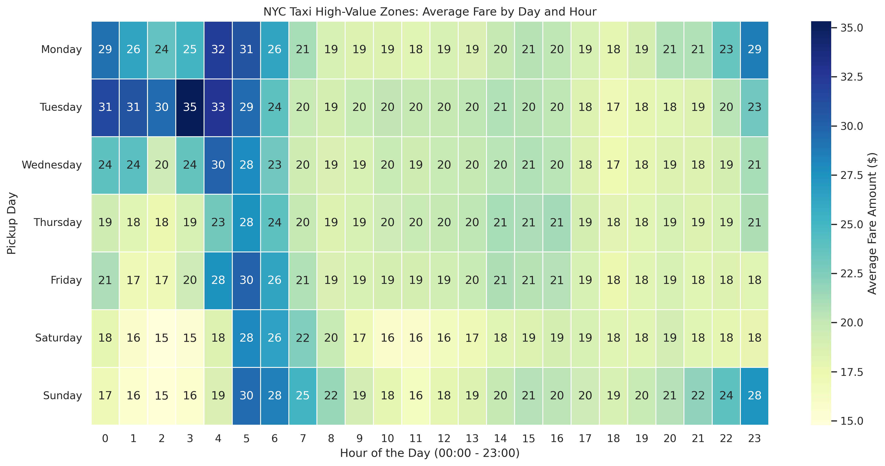
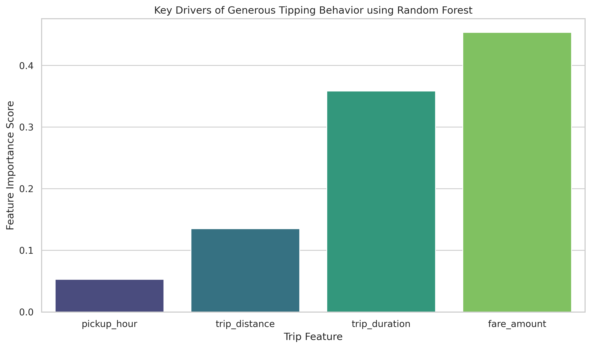

# NYC Taxi Optimization: Predictive Analytics & Driver Yield Maximization

## 📌 Project Overview
This project applies end-to-end data science methodologies to the **NYC Yellow Taxi Trip Records** dataset to optimize ride-hailing driver deployment, analyze tipping behavior, and predict high-value fares. By moving messy, raw data through a structured data-engineering pipeline, we built a binary classification model designed to help drivers maximize revenue by predicting **"Generous Tips"** (tips exceeding 20% of the base fare).

### 🛠️ Tech Stack & Key Libraries
* **OS/Environment:** Ubuntu Linux, Git/GitHub
* **Data Pipelines & EDA:** Python, Pandas, NumPy, PyArrow (Parquet engine)
* **Machine Learning:** Scikit-Learn (Logistic Regression, RandomForestClassifier, StandardScaler)
* **Data Visualization:** Matplotlib, Seaborn

---

## 📁 Repository Architecture
This repository follows an industry-standard production framework to ensure reproducibility and clean modularity:

```text
nyc-taxi-optimization/
│
├── data/                  # Local directory for datasets (Excluded via .gitignore)
│   ├── raw/               # Original raw NYC Parquet files
│   └── processed/         # Structured data saved for modeling
│
├── notebooks/             # Step-by-step exploratory work and visuals
│   ├── 01_eda_and_cleaning.ipynb
│   └── 02_machine_learning.ipynb
│
├── src/                   # Production-ready Python scripts 
│   ├── __init__.py
│   ├── data_cleaning.py   # Modular functions for outlier removal
│   └── features.py        # Scalable feature engineering pipelines
│
├── requirements.txt       # Environment dependencies
└── README.md
```

## 🧼 Phase 1: Data Hygiene & Feature Engineering
Raw taxi data contains significant noise, requiring strict data validation parameters to prevent downstream model degradation.

### Key Operations
1. **Outlier Filtering:** Retained entries with valid distances (`0 < trip_distance < 50` miles) and compliant legal fare baselines (`$2.50 <= fare_amount <= $200`).
2. **Feature Extraction:** Dissected datetime stamps to extract granular operations metrics (`pickup_hour` and `day_of_week`).
3. **Behavioral Tracking:** Engineered a `tip_percentage` metric restricted entirely to **Credit Card transactions** (`payment_type == 1`) to eliminate cash-reporting skews.

### Operational Insight
Our time-series aggregation reveals that driver yield fluctuates drastically based on the clock. 


*Figure 1: Average fare yields peaking during specialized evening blocks and late-night weekend operational windows.*

---

## 🤖 Phase 2 & 3: Machine Learning & Performance Evaluation
To turn analysis into predictive business tools, we framed our goal as a **Binary Classification** problem: predicting whether a trip will yield a **Generous Tip** (`is_generous_tip > 20%`).

### Model Progression & Comparison
We trained a baseline **Logistic Regression** model and challenged it using an ensemble **Random Forest Classifier** (`n_estimators=100`, `max_depth=10`). 

* Numerical features (`trip_distance`, `fare_amount`, `trip_duration`, `pickup_hour`) were scaled via `StandardScaler` to mitigate variations in structural magnitude.
* Training/Testing split maintained an 80/20 data allocation with a static seed (`random_state=42`).

### 📊 Model Trade-offs & Production Deployment
In a driver-facing scenario, **Precision for Class 1 (Generous Tip)** is our primary success metric. High Precision ensures that when the model alerts a driver to accept a ride, the probability of receiving that high tip is accurate—minimizing the operational costs of false positives (wasting fuel/time chasing fake leads).

### Drivers of Tipping Behavior
Evaluating model properties gives us immediate clarity on why riders choose to tip generously:


*Figure 2: Global feature importances derived from our Random Forest Architecture.*

> **Key Takeaway:** Counter-intuitively, `fare_amount` heavily impacts the baseline classification threshold. Because tip percentages are relative, higher base fares structurally require a massive absolute dollar amount to clear the 20% mark, making shorter, high-efficiency trips prime real estate for maximizing tip margins.